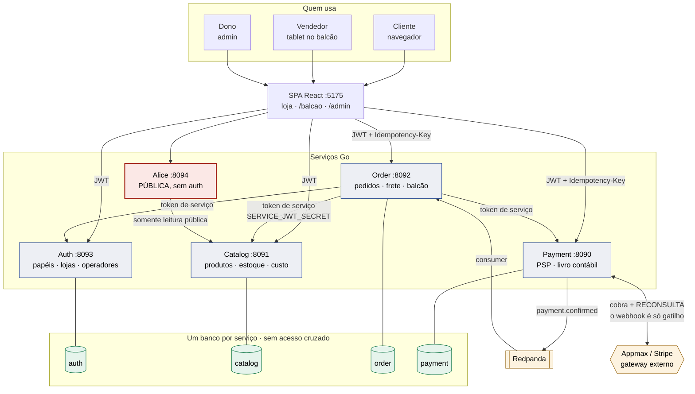

# Arquitetura — fluxo de venda e fronteiras de confiança

Diagrama validado (sintaxe conferida no Mermaid). Renderiza direto no GitHub.

O que ele torna visível e o texto não:

- **A Alice é o único serviço público sem autenticação** (em vermelho). Foi por
  isso que o achado A1 importava: ela carregava o segredo que emitia token de
  administrador. Hoje ela só tem leitura pública do catálogo.
- **O token de serviço parte apenas do order-service.** Nenhuma outra seta usa
  `SERVICE_JWT_SECRET`.
- **O webhook do PSP é seta de ida E volta**: o corpo é só gatilho; status e
  valor vêm da reconsulta autenticada.
- **Um banco por serviço, sem seta entre bancos.** Não existe caminho de
  `SELECT` cruzado — quem precisa de dado alheio chama a API.

Ver também [`../CLAUDE.md`](../CLAUDE.md) e
[`security/auditoria-arquitetural-2026-07-18.md`](security/auditoria-arquitetural-2026-07-18.md).
